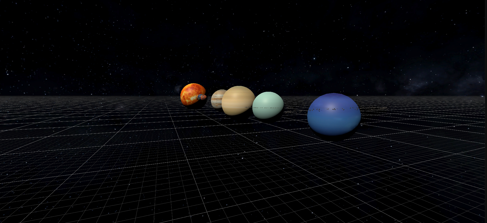

# 🪐 Solar System Simulation
A physics-based 3D simulation of our solar system built in **Unity**. This project focuses on orbital mechanics, scaled celestial bodies, and realistic lighting within a 3D environment.

### ✨ Key Features
* **Orbital Mechanics:** C# scripts handling the rotation and revolution of planets based on relative speeds.
* **Realistic Texturing:** High-resolution textures for all major planets and the Sun.
* **Camera Navigation:** Smooth controls to explore the planetary scale.

### 🛠️ Tech Stack
* **Engine:** Unity
* **Language:** C#
* **Concepts:** 3D Transformations, Math-based movement, Lighting.
